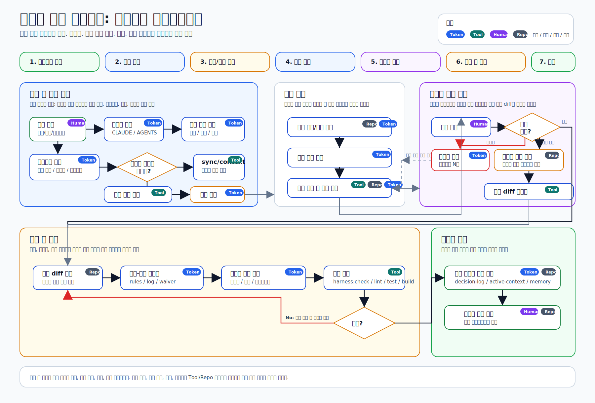

# harness-seed

하네스시드는 프로젝트에 공통 하네스를 설치하는 저장소이자 패키지입니다.

업무 코드나 scaffold를 직접 제공하는 템플릿이 아니라, 회사 공통 기준을 내부 베이스로 깔고 프로젝트가 선택한 스택 기준과 프로젝트 로컬 기준이 함께 동작하도록 연결합니다. 개발자가 실제로 프로젝트에 적용해 사용하는 것은 이 저장소 이름이 아니라 **공통 하네스**입니다.

## 용어

| 용어 | 의미 |
| --- | --- |
| 하네스 | AI 에이전트와 사람이 같은 기준으로 작업하도록 돕는 문서, 명령, 검증, 훅의 전체 체계 |
| 공통 하네스 | 특정 기술스택과 무관한 회사 공통 개발 흐름, 세션 복구, 기준 동기화, 검증 절차 |
| 하네스시드 | 공통 하네스를 프로젝트에 설치하거나 업데이트하는 이 저장소와 패키지 이름 |
| 스택 하네스 | Vue, API 서버, batch 같은 특정 기술스택의 개발 기준을 공통 하네스 위에 얹는 패키지 |
| 템플릿 | 실제 코드 scaffold를 제공하는 별도 저장소 |
| 프로젝트 하네스 | 적용 프로젝트 안에서 쌓이는 도메인, 아키텍처, 워크플로우 기준 |
| 개인 기준 | 개인만 참고하는 선호와 작업 방식. 프로젝트 공유 기준을 덮어쓰지 않습니다. |

문서에서 과거에 쓰던 “일반 하네스” 표현은 “공통 하네스”와 같은 의미였지만, 앞으로는 “공통 하네스”로 통일합니다.

## 기본 관점

프롬프트는 의도를 전달하지만, 하네스는 실수했을 때 피해를 제한합니다.

공통 하네스는 AI 에이전트를 완전한 천재 개발자로 전제하지 않습니다. 빠른 실행력을 가진 불완전한 자동화 도구로 보고, 그 주변에 테스트, 제한, 관찰, 복구, 차단 장치를 깔아 개발 중 발생할 수 있는 피해를 줄이는 것을 목표로 합니다.



이 이미지는 개발 요청 수신부터 코딩 전 판단, 초안 구현, 개발자 재수정 루프, 직접 수정 반영, 최종화 검증, 커밋 확정까지의 전체 흐름입니다.


이 이미지는 코딩 전 사고 흐름을 더 자세히 보여주는 현재 기준의 스냅샷입니다. 에이전트 진입 흐름, 기준 우선순위, 충돌 해석, 검증 절차, 요청 라이프사이클이 바뀌면 두 이미지를 함께 갱신해야 합니다.

개발자가 하네스 문서를 모두 읽고 시작할 필요는 없습니다. 설치된 프로젝트에서는 `npm run harness:guide`로 현재 상태 대시보드와 클릭형 가이드를 열고, 필요한 단계의 명령과 파일만 좁혀 봅니다.

에이전트도 모든 문서를 매번 읽지 않습니다. 큰 작업이나 낯선 요청은 `npm run harness:context -- "<작업 설명>"`로 작업 유형, 관련 문서, 선택된 하네스 스킬을 먼저 좁힌 뒤 진행합니다. 여기서 스킬은 Claude command나 외부 Codex skill이 아니라, 요청별로 읽을거리와 실행 명령, 기록 위치를 고르는 공통 하네스 내부 작업 절차입니다.

스킬의 내부 ID는 자동화를 위해 영어로 유지하지만, 개발자에게 보이는 이름과 설명은 한국어로 제공합니다. 예를 들어 `harness.bugfix-flow`는 `버그 수정 흐름`으로 표시됩니다.

## 목적

- AI 에이전트와 사람이 같은 개발 기준을 읽고 작업하게 합니다.
- 특정 기술스택에 종속되지 않는 공통 개발 흐름과 검증 절차를 프로젝트에 설치합니다.
- 회사 공통 기준, 스택 기준, 템플릿 사용 계약, 프로젝트 기준, 개인 기준이 공존할 수 있는 계층을 만듭니다.
- 기존 프로젝트의 코드 스타일, 아키텍처, 업무 규칙을 지우지 않고 로컬 기준으로 정리합니다.
- 기준 문서와 실제 코드, 설정, 검증 명령이 어긋나는 지점을 확인할 수 있게 합니다.

## 기대효과

- 새로 참여한 개발자나 AI 에이전트가 먼저 읽어야 할 기준 위치가 고정됩니다.
- 프로젝트마다 흩어져 있던 스타일, 도메인, 작업 절차를 문서와 명령으로 확인할 수 있습니다.
- 기존 전용 하네스나 개인 룰이 있더라도 보존하고, 필요한 연결 지점을 리포트로 제안합니다.
- `harness:scan`으로 현재 프로젝트의 스택, 문서, 스타일, 충돌 후보를 스캔할 수 있습니다.
- `harness:check`로 문서 링크, 기준 동기화, 스택 적용 상태, lint/test/build 연결 상태를 검사할 수 있습니다.
- 스택 기준과 scaffold 템플릿을 분리해 기존 프로젝트와 새 프로젝트에 같은 방식으로 적용할 수 있습니다.

## 사용법

### 1. 프로젝트 폴더에서 스택 하네스 설치

실제 프로젝트 개발자는 보통 하네스시드를 직접 고르지 않습니다. 프로젝트에 맞는 스택 하네스를 선택하면, 그 스택 하네스가 내부적으로 공통 하네스를 설치하거나 업데이트한 뒤 자기 기준을 로컬룰로 정착시킵니다.

이미 작업 중인 프로젝트라면 그 폴더로 이동합니다. 새 프로젝트라면 빈 폴더를 만든 뒤 같은 명령을 실행합니다.

```bash
cd my-project
npm run standards:list
npx -y git+<stack-harness-repo-url>#<tag> init
```

스택 하네스의 `init`은 다음 순서로 동작합니다.

1. 공통 하네스가 없으면 설치하고, 있으면 관리 파일을 업데이트합니다.
2. 기존 프로젝트의 package stack과 이미 적용된 하네스 스택이 선택한 스택 하네스와 맞는지 검사합니다.
3. 맞지 않으면 설치를 시작하기 전에 중단하고, 조회 가능한 후보 중 맞는 스택 하네스가 있으면 추천합니다.
4. 선택한 스택 기준을 `.harness/project/stack-preset-rules.md`에 프로젝트 로컬룰로 기록합니다.
5. 필요한 scaffold 템플릿을 별도로 적용하면 `.harness/project/template-contract.md`에 템플릿 사용 계약 브리지를 기록합니다.
6. `.harness/harness-lock.json`에 실제 설치된 공통 하네스, 스택 하네스, scaffold 템플릿의 repo, ref, version을 기록합니다.
7. 현재 프로젝트를 스캔하고 `.harness/session/project-scan-report.md`를 생성합니다.
8. 설치/업데이트 인수인계 요약을 `.harness/session/handoff.md`에 생성합니다.
9. `harness:check`로 문서 링크, 기준 동기화, 스택 적용 상태를 확인합니다.

자동 스캔, 인수인계 요약, 검사를 끄고 싶으면 `--no-scan`, `--no-handoff`, `--no-check` 옵션을 사용합니다.

### 2. 스캔 리포트 확인

설치 후 `.harness/session/project-scan-report.md`를 먼저 봅니다. 이 리포트에는 감지된 기술 스택, 기존 스타일 설정, 기존 AI 작업 룰 후보, 충돌 후보, 확인 질문이 정리됩니다.

다시 스캔하려면 다음 명령을 실행합니다.

```bash
npm run harness:scan
```

전체 문서를 훑지 않고 현재 상태와 단계별 안내를 보려면 다음 명령을 실행합니다.

```bash
npm run harness:guide
```

이 명령은 `.harness/generated/harness-dashboard.html`을 만들고, 클릭형 가이드인 `.harness/documentation/guide/index.html`의 위치를 함께 안내합니다.

### 3. 다른 스택 기준 조회

```bash
npm run standards:list
```

`standards:list`는 적용 가능한 스택 하네스 후보와 `npx ... init` 명령을 보여줍니다. 공통 하네스가 이미 설치된 관리자/고급 흐름에서는 `npm run stack:apply -- --preset-git <repo-url> --ref <tag>`로 직접 적용할 수도 있습니다.

### 4. 필요한 경우 scaffold 템플릿 선택

기존 프로젝트에 기준만 적용하는 경우에는 scaffold 템플릿이 필요하지 않을 수 있습니다. 새 프로젝트의 기본 파일 묶음이 필요할 때만 템플릿 목록을 확인합니다.

```bash
npm run templates:list
```

템플릿 적용 방식은 각 템플릿 저장소의 README와 manifest 계약을 기준으로 확인합니다.

공통 하네스가 설치된 상태에서 템플릿을 직접 적용하는 관리자/고급 흐름은 다음 명령을 사용합니다.

```bash
npm run template:apply -- --preset-git <template-repo-url> --ref <tag-or-branch>
```

템플릿의 전체 개발 가이드는 템플릿 저장소가 소유하고, 적용 프로젝트에는 `.harness/project/template-contract.md` 브리지만 생성됩니다. 프로젝트별 예외나 추가 규칙은 `domain-rules.md`, `architecture-rules.md`, `workflow-rules.md`에 남깁니다. commit/push hook 자체의 운영 기준은 `commit-push-rules.md`에 따로 둡니다.

### 5. 완료 승인 뒤 검증과 커밋 차단 연결

개발 중에는 다음 명령으로 현재 기준과 프로젝트 상태를 확인할 수 있습니다. 다만 에이전트가 사용자의 일반 작업 지시만 받고 임의로 최종 검증까지 진행해서는 안 됩니다.

```bash
npm run harness:check
```

사용자가 `완료`, `최종 검증`, `커밋`, `푸시`, `PR 생성`처럼 명시적으로 최종화 의사를 밝히기 전에는 `build`, `test`, `harness:check`, 배포, commit, push, PR 생성을 실행하지 않습니다. 필요해 보이는 검증은 먼저 `검증 후보`로 보고하고 승인을 받습니다.

최종화 승인 뒤에도 요청 종류에 따라 검증 경로를 나눕니다.
에이전트는 이 판단을 `.harness/skills/registry.json`의 `커밋/푸시 최종화 흐름` 스킬로도 선택할 수 있습니다.

| 사용자 요청 | 에이전트 검증 경로 |
| --- | --- |
| `최종 검증만 해줘` | `npm run harness:check`를 직접 실행 |
| `커밋해줘` | hook 설치 상태라면 선행 `harness:check` 없이 `git commit` 실행. pre-commit hook이 전체 검증 수행 |
| `커밋하고 푸시해줘` | pre-commit 전체 검사와 pre-push fast 검사에 맡김 |
| hook 미설치 또는 `--no-verify` 우회 | commit/push 전에 에이전트가 직접 `npm run harness:check` 실행 |
| 대형 변경의 빠른 실패 확인 | 수동 check 가능. 이후 commit hook에서 다시 실행될 수 있음을 먼저 알림 |

사람이 직접 커밋하는 흐름에서도 같은 검증을 강제하고 싶으면 git hook을 설치합니다.

```bash
npm run hooks:install
```

이 명령은 `.githooks/`와 함께 `.github/commit-template.txt`를 git commit template로 연결합니다. hook은 작업 완료 시점을 결정하지 않고, 사용자가 commit/push를 승인한 뒤 실행되는 최종 안전장치입니다. 커밋 메시지는 아래 형식을 기준으로 씁니다.

`hooks:install`은 기존 `.git/hooks/*` 파일을 삭제하거나 덮어쓰지 않습니다. 기존 `.git/hooks/pre-commit`, `.git/hooks/pre-push` 또는 기존 `core.hooksPath`의 hook이 있으면 그 경로를 `harness.previousHooksPath`에 저장하고, `.githooks/pre-commit`/`.githooks/pre-push`가 기존 hook을 먼저 실행한 뒤 하네스 검사를 실행합니다.

```text
변경 요약

- 주요 변경 1
- 주요 변경 2

검증
- pre-commit hook: npm run harness:check
```

첫 줄은 현재 커밋할 내용의 간략 정보를 한글로 적고, 세부사항은 하이픈 목록으로 정리합니다. 실행하지 못한 검증은 생략하지 말고 사유를 남깁니다.

AI 에이전트 작업에서는 hook 선택 여부와 별개로 하네스 기준을 따라야 합니다. 단, 완료 승인 전에는 무거운 검증과 side effect 있는 작업을 실행하지 않고 최종화 승인 뒤에 실행합니다.

hook이 설치된 프로젝트에서 `커밋해줘` 요청을 받았다면 pre-commit hook이 `npm run harness:check`를 실행하므로, 에이전트가 같은 명령을 먼저 한 번 더 실행하지 않습니다.

### 공통 하네스 직접 설치

`harness-seed` 직접 설치는 공통 기준 관리자, 스택 하네스 관리자, 또는 예외적으로 스택 기준 없이 공통 기준만 운영하는 프로젝트를 위한 고급 흐름입니다.

```bash
npx -y git+https://git.smartscore.kr/ai-standard/harnesses/harness-seed.git#v0.2.18 init
```

공통 하네스는 계속 개선되므로 `main`, `master` 같은 움직이는 브랜치를 따라가며 최신 변경을 빠르게 받는 방식도 가능합니다. 다만 팀 프로젝트에서는 하네스 변경이 언제 들어왔는지 추적할 수 있도록 릴리스 태그인 `vX.Y.Z`를 고정해 주입하는 것을 권장합니다. 최신 버전으로 올릴 때는 스택 하네스의 새 태그로 다시 `init`을 실행하고, 생성된 변경분과 `harness:scan`, `harness:check` 결과를 함께 확인합니다.

## 버전 추적과 업데이트

프로젝트에는 두 종류의 버전 정보가 남습니다.

| 파일 | 역할 |
| --- | --- |
| `.harness/install-manifest.json` | 공통 하네스가 어떤 파일을 설치/갱신했는지 추적하는 설치 manifest |
| `.harness/harness-lock.json` | 현재 프로젝트에 설치된 공통 하네스와 스택 하네스의 repo, ref, version을 기록하는 잠금 파일 |

스택 하네스의 `manifest.json`은 자신이 요구하는 공통 하네스를 `baseHarness`로 명시합니다. `minVersion`은 최소 요구 버전이고, `ref`는 검증된 기준 ref입니다. 기본적으로 `ref`는 exact pin이 아니므로 이미 설치된 공통 하네스가 `minVersion` 이상이면 더 낮은 ref로 자동 downgrade하지 않아야 합니다. 정확한 ref 고정이 필요한 스택만 `exactRefRequired: true`를 명시합니다.

업데이트는 보통 다음처럼 진행합니다.

```bash
npm run harness:outdated
npm run harness:update
npm run harness:changelog
npm run harness:scan
npm run harness:check
```

`harness:outdated`는 `.harness/harness-lock.json`을 읽고 공통 하네스와 스택 하네스를 모두 확인합니다. 둘 중 하나라도 업데이트 후보가 있으면 전체 상태를 `outdated`로 표시합니다.

`harness:update`는 업데이트가 끝나면 이번에 반영된 공통 하네스 변경 항목(이전 버전 → 새 버전 사이의 `CHANGELOG.md` 구간)을 바로 출력합니다. 같은 내역은 `.harness/harness-lock.json`의 `lastUpdate`에 보존되어 `npm run harness:changelog`로 언제든 다시 볼 수 있습니다. 소비자 프로젝트에는 본체 `CHANGELOG.md`를 복사하지 않으므로, 이 변경 요약은 업데이트 시점에 기록한 `lastUpdate`가 출처입니다.

`harness:update`는 안전을 위해 기존처럼 현재 적용된 스택 하네스를 다시 실행합니다. 공통 하네스만 업데이트하려면 `--base-only`를 명시합니다. 기본 전략은 `compatible`이며, 현재 설치된 버전의 SemVer caret 범위 안에서 최신 태그를 선택합니다. 예를 들어 `1.0.0`이 설치되어 있으면 `^1.0.0` 범위의 최신 패치/마이너를 받습니다. 스택 업데이트 중 공통 하네스 요구사항을 볼 때는 `baseHarness.minVersion`을 우선하며, 설치된 공통 하네스가 이미 최소 버전 이상이면 `baseHarness.ref`가 더 낮아도 자동 downgrade하지 않습니다.

공통 하네스만 업데이트하는 `npm run harness:update -- --base-only`는 다음 업데이트 감지를 위해 공통 하네스의 git repo/ref/version을 lock과 install manifest에 남깁니다. update가 `semver:*` range로 실행되더라도 기록되는 ref는 실제 설치된 package version tag(`vX.Y.Z`)입니다. 과거 업데이트나 `ai-standard-cli` 경유 설치로 base source가 `bundled`로 남은 프로젝트도 스택의 `requiredBaseHarness.repo` 또는 공식 공통 하네스 repo와 현재 base version으로 `harness:outdated`가 repo/ref를 복구합니다.

```bash
npm run harness:outdated -- --json
npm run harness:outdated -- --fail-on-outdated
npm run harness:outdated -- --base-only
npm run harness:outdated -- --stack-only
npm run harness:update -- --dry-run
npm run harness:update -- --base-only
npm run harness:update -- --stack-only
npm run harness:update -- --strategy locked
npm run harness:update -- --strategy latest
npm run harness:update -- --range ^1.0.0
npm run harness:update -- --force --confirm-overwrite-project-files
```

`harness:update -- --force`도 프로젝트 소유 문서를 덮어쓸 수 있으므로 단독 실행은 중단됩니다. 실제 덮어쓰기는 `--confirm-overwrite-project-files`를 함께 지정해야 합니다.

`harness:outdated`는 원격 tag를 조회해 업데이트 후보가 있는지만 확인하고 프로젝트 파일은 수정하지 않습니다. 출력에는 `baseHarness`, `stackHarness`별 현재 버전, 최신 버전, 상태, 실제 업데이트 명령이 분리되어 표시됩니다. 향후 `ai-standard-cli`에서 여러 프로젝트에 업데이트 MR을 만들 때도 이 명령을 먼저 호출하는 방식으로 확장합니다.

같은 스택 하네스를 새 버전으로 다시 실행하면 스택 기준은 기존 적용분을 reset한 뒤 다시 적용됩니다. 공통 하네스는 스택의 최소 요구 버전을 만족하지 못할 때만 업데이트 대상이 됩니다. 프로젝트 소유 문서와 기존 업무 코드, 프로젝트가 직접 바꾼 `profile.json`의 `harnessMode`와 `sources[]`는 보존됩니다. 적용 후 `stack:status`와 `harness:scan`에서 공통/스택 하네스 버전 상태를 확인할 수 있습니다.

## 공통 하네스가 하는 일

공통 하네스 설치기는 프로젝트에 다음을 추가합니다.

| 항목 | 역할 |
| --- | --- |
| `.harness/` | 회사 공통 기준 참조, 프로젝트 기준, 검증 기준, 세션 문맥을 담는 본체 |
| `.harness/project/local-methodology.md` | 프로젝트 고유 개발방법론의 진입점 |
| `.harness/project/stack-preset-rules.md` | 선택한 스택 기준이 프로젝트 로컬룰로 정착되는 문서 |
| `.harness/skills/` | 요청 유형별로 읽을 문서, 실행 명령, 기록 위치를 고르는 에이전트 작업 절차 |
| `CLAUDE.md` | AI 에이전트가 가장 먼저 읽는 기준 진입점 |
| `AGENTS.md` | Claude가 아닌 에이전트도 같은 기준을 읽게 하는 보조 진입점 |
| `.claude/` | Claude Code용 명령, hook, 보조 에이전트 연결 |
| `.codex/` | Codex용 context injection hook과 조건부 업무 보고 리마인더 |
| 플랫폼 어댑터 | 사용하는 코드 호스팅, CI, 에이전트 도구와 하네스를 연결하는 선택형 파일 |
| `.harness/bin/` | 기준 동기화 검사, 문서 링크 검사, 프로젝트 분석, 스택 적용 명령 |
| `.githooks/` | 커밋/푸시 직전 hook 검증 연결 |

중요한 점은 업무 코드 자체를 대신 작성하는 것이 아니라, 작업 기준과 검증 경로를 프로젝트 안에 고정한다는 점입니다.

## 본체 개발 자료와 소비자 프로젝트 자료

하네스 본체 저장소에서 쓰는 개발 기록과, 적용 대상 프로젝트에 제공되는 운영 문서는 구분합니다.

| 구분 | 본체 저장소 | 소비자 프로젝트 |
| --- | --- | --- |
| 변경 이력 | `CHANGELOG.md`, 릴리스 태그 | 해당 없음 |
| 본체 설계 판단 | 본체의 `.harness/session/decision-log.md` | 복사하지 않음 |
| 프로젝트 판단 | 해당 없음 | 소비자용 `.harness/session/decision-log.md` 템플릿 생성 |
| 현재 작업 맥락 | 본체의 `.harness/session/active-context.md` | 소비자용 `active-context.md` 템플릿 생성 |
| 장기 메모리 | 본체의 `.harness/session/project-memory.md` | 소비자용 `project-memory.md` 템플릿 생성 |

즉, `decision-log.md`는 릴리스 노트나 체인지 로그가 아닙니다. 설치된 프로젝트에서는 그 프로젝트의 기준 충돌, 예외, 아키텍처 선택 이유를 남기는 곳입니다. 하네스 본체의 변경 요약은 `CHANGELOG.md`와 Git 태그로 관리합니다.

최초 설치 시 `active-context.md`, `decision-log.md`, `developer-input-queue.md`, `next-session-reminder.md`, `project-memory.md`는 본체 파일을 그대로 복사하지 않고 소비자 프로젝트용 템플릿으로 생성합니다. 업데이트 시에는 기존 프로젝트 내용이 보존되며, 과거 버전에서 본체 문서가 그대로 복사된 상태이고 사용자가 수정하지 않은 경우에만 소비자용 템플릿으로 교체합니다.

## 강제되는 것과 강제되지 않는 것

공통 하네스는 모든 규칙을 처음부터 강제하지 않습니다. 규칙의 성격에 따라 단계가 다릅니다.

| 단계 | 의미 | 예시 |
| --- | --- | --- |
| 안내 | 사람이 읽고 판단해야 하는 기준 | 프로젝트 목적, 도메인 설명, 작업 원칙 |
| 초안 | 기존 설정이나 문서를 분석해 제안한 기준 | `.editorconfig`, `.eslintrc`에서 추출한 스타일 초안 |
| 로컬룰 | 프로젝트가 선택한 기준 | 프로젝트 고유 방법론, 적용한 스택 기준 |
| 검증 | 명령으로 확인 가능한 기준 | 문서 링크, 기준-코드 동기화, lint/test/build |
| 차단 | 통과하지 못하면 커밋이나 CI를 막는 기준 | git hook, CI check |

따라서 공통 하네스는 모든 프로젝트에 같은 스타일을 강제하는 도구가 아닙니다.

예를 들어 기존 프로젝트가 세미콜론을 사용한다면, 공통 하네스는 그것을 지우지 않습니다. `.eslintrc`, `.editorconfig`, formatter 설정을 읽고 `Style Rule Draft`로 정리한 뒤, 프로젝트 로컬룰로 승격할 수 있게 합니다.

## 기준 계층과 충돌 해석

기준은 `회사 공통 -> 스택 -> 템플릿 -> 프로젝트 -> 개인` 순서로 쌓입니다. 이 순서는 설치와 이해의 기반 순서입니다.

실제 작업 중 충돌하면 더 구체적인 작업 맥락을 우선합니다. 다만 회사 공통 기준 중 보안, 권한, 검증, 복구, 기록, 차단처럼 피해를 제한하는 기준은 `회사 공통 필수 차단 기준`으로 보고 가장 앞에 둡니다.

충돌 해석 순서는 `회사 공통 필수 차단 기준 -> 사용자 명시 지시 -> 프로젝트 기준 -> 템플릿 계약 -> 스택 기준 -> 회사 공통 기본 운영 기준 -> 개인 기준 -> 에이전트 기본값`입니다. 생성 컨텍스트는 기준이 아니라 보조 산출물이므로 이 우선순위에 넣지 않습니다.

## 기존 프로젝트에 넣으면 어떻게 되는가

기존 프로젝트에 공통 하네스를 설치하면 다음 원칙을 따릅니다.

1. 기존 업무 코드는 덮어쓰지 않습니다.
2. 기존 하네스나 개인/전용 AI 룰 파일이 있으면 먼저 보존합니다.
3. 공통 하네스 설치기가 만든 파일은 `.harness/install-manifest.json`으로 추적합니다.
4. 실제 설치된 공통/스택 하네스 버전은 `.harness/harness-lock.json`으로 추적합니다.
5. 출처를 알 수 없는 기존 파일은 기본적으로 프로젝트 소유로 봅니다.
6. 기존 로컬 방법론은 `.harness/project/` 아래 문서와 연결합니다.

즉, 기존 프로젝트의 개발 방식을 삭제하는 것이 아니라 다음처럼 공존시킵니다.

| 기존 프로젝트에 있는 것 | 공통 하네스 설치기의 처리 |
| --- | --- |
| 기존 코드 스타일 설정 | 스타일 출처로 감지하고 초안 작성 |
| 기존 개인/전용 AI 룰 문서 | 보존하고 스캔/인수인계 리포트에 후보와 등록 기준 안내 |
| 기존 아키텍처 규칙 | 로컬 방법론 문서에 연결 |
| 기존 테스트/빌드 명령 | 검증 후보로 감지 |
| 기존 CI | 보존하고 필요한 check 연결만 검토 |

## 새 프로젝트와 기존 프로젝트

| 상황 | 권장 방식 |
| --- | --- |
| 기존 프로젝트에 회사 기준 적용 | 프로젝트에 맞는 스택 하네스 `init` 실행 후 기존 프로젝트 기준과 충돌 여부 확인 |
| 빈 프로젝트를 새로 시작 | 스택 하네스 `init` 실행 후 필요한 scaffold 템플릿 적용 |
| 이미 팀 전용 하네스가 있음 | 기존 하네스를 보존하고 브리지로 연결 |
| 스타일 기준이 이미 있음 | 설정 파일을 읽어 로컬룰 초안 생성 |
| 스타일 기준이 없음 | 프리셋 후보 중 선택 |

## 로컬 룰은 어떻게 자라는가

스택 하네스만 설치된 초기 프로젝트에는 프로젝트 고유의 도메인 규칙이 거의 없을 수 있습니다. 이 상태에서 AI 에이전트가 버그 수정을 맡으면, 하네스는 완성된 답을 주기보다 기존 코드에서 반복 패턴을 찾고 로컬 룰 후보를 남기게 합니다.

프로젝트 하네스를 의도적으로 만들거나 보강해야 한다면 `.harness/project/project-harness-guide.md`를 기준으로 삼습니다. 이 문서는 공통 하네스, 스택 하네스, 프로젝트 로컬룰, 개인룰의 역할을 나누고, 어떤 내용을 `domain-rules.md`, `architecture-rules.md`, `workflow-rules.md`, `commit-push-rules.md`로 승격할지 안내합니다.

예를 들어 "외부 시스템 동기화 작업에서 같은 이벤트를 재처리하면 중복 결과가 생긴다"는 버그가 들어왔다고 가정합니다.

1. 에이전트는 먼저 공통 기준과 스택 기준을 읽고, 입력 수집, 중복 판단, 저장, 외부 시스템 호출 중 어디가 책임 영역인지 좁힙니다.
2. 기존 처리 흐름들을 확인해 같은 외부 이벤트는 고유 키로 중복 처리를 막는다는 반복 패턴을 찾습니다.
3. 현재 버그도 같은 기준으로 수정하고 `npm run harness:check`로 검증합니다.
4. 이 패턴을 `.harness/project/architecture-rules.md`에 "외부 이벤트 처리에는 재처리 안전성을 확인할 수 있는 고유 키를 둔다"는 로컬 룰 후보로 기록합니다.
5. 같은 문제가 반복되면 `.harness/project/workflow-rules.md`에 외부 시스템 연동 변경 시 확인 항목으로 승격하고, 가능하면 테스트로 옮깁니다.

이 흐름에서 하네스가 하는 일은 프로젝트 도메인 규칙을 임의로 발명하는 것이 아닙니다. 기존 코드, 반복 패턴, 사용자 확인을 근거로 프로젝트의 기억을 `.harness/project/*`에 쌓아 다음 작업부터 에이전트가 추측 대신 로컬 기준을 따르게 만드는 것입니다.

## 사고 흐름은 어떻게 보이는가

에이전트의 원시 내부 추론을 그대로 콘솔 로그처럼 노출하지는 않습니다. 대신 개발자가 검토할 수 있는 형태의 visible trace를 남깁니다. trace는 생각의 전문이 아니라 작업 단계, 확인한 기준, 실행한 명령, 선택한 판단, 검증 결과입니다.

권장 출력 형태는 다음과 같습니다.

```text
[harness] request: 목표/범위/완료조건 정리
[harness] context: 읽은 기준과 추가 확인 문서
[harness] impact: 영향 파일군과 충돌 후보
[harness] action: 실행한 명령 또는 수정한 범위
[harness] decision: 선택한 기준, 예외, 보류 질문
[harness] verify: harness:check/lint/test/build 결과
```

이 trace는 `harness:handoff`, `harness:impact`, `harness:check`, 에이전트 최종 응답이 서로 같은 흐름을 말하게 만드는 용도입니다. 자세한 판단 근거는 `decision-log.md`, `developer-input-queue.md`, `waivers.json` 중 알맞은 곳에 남깁니다.

## 로컬 룰이 너무 많아질 때

운영 기간이 길어질수록 프로젝트 룰은 늘어납니다. 하네스는 모든 룰을 매 요청마다 읽는 방식으로 해결하지 않습니다.

1. 항상 읽는 최소 기준은 `CLAUDE.md`, 최상위 정책 참조, 세션 시작 알림, 현재 컨텍스트로 제한합니다.
2. 에이전트는 큰 작업이나 낯선 작업 전에 `harness:context`를 사용해 판단 기준, 충돌 우선순위, 영향 후보를 좁힙니다. 개발자가 업무 지시 때마다 직접 실행할 필요는 없습니다.
3. 긴 룰 문서는 인덱스와 세부 문서로 나누고, 상단에는 최신 요약과 적용 범위를 둡니다.
4. 오래된 결정은 삭제하기보다 `decision-log.md`에 변경 이유를 남기고 최신 기준만 프로젝트 룰에 남깁니다.
5. 한 번뿐인 구현 세부사항은 프로젝트 룰로 승격하지 않습니다.

즉, 프로젝트 룰은 무제한 프롬프트 재료가 아니라 검색 가능한 기준 저장소로 봅니다. 에이전트는 최소 기준을 먼저 읽고, 나머지는 작업 설명과 현재 diff에 맞춰 선택적으로 가져옵니다.

## 에이전트 판단 컨텍스트

하네스는 모든 기준 문서를 프롬프트에 한꺼번에 넣는 방식을 권장하지 않습니다. 항상 읽어야 하는 최소 기준은 `CLAUDE.md`에 짧게 고정하고, 실제 작업마다 필요한 기준은 에이전트가 로컬에서 다시 합성합니다.

```bash
npm run harness:sync
npm run harness:context -- "예약 버그 원인 분석과 수정"
```

개발자는 이 명령을 매번 직접 실행하지 않아도 됩니다. 에이전트가 큰 작업, 낯선 영역, 기준 충돌 가능성이 있는 작업에서 코딩 전에 실행합니다.

`harness:sync`는 현재 프로젝트의 구조, import, 스크립트, 감지된 패턴을 `.harness/generated/**` 아래에 재생성합니다. `harness:context`는 작업 설명을 기준으로 `.harness/session/task-context.md`에 `Agent Decision Context`를 남깁니다. 이 문서는 작업 유형, 관련 기준, 충돌 우선순위, 영향 후보, 검증 요구사항을 한곳에 모읍니다.

이 산출물은 원본이 아닙니다. 진실 출처는 실제 코드, 설정 파일, `.harness/project/*.md`, `.harness/policy/*.md`입니다. 생성 컨텍스트와 원본이 충돌하면 원본을 우선하고, 기준 충돌이나 예외는 `decision-log.md` 또는 `waivers.json`에 남깁니다.

긴 대화창에서 여러 업무가 섞여 에이전트의 현재 범위 인식이 흐려지면 [Workstream 대화창 분리 가이드](.harness/documentation/workstream-chat-splitting-guide.md)를 참고합니다. 이 방식은 선택형이며, 프로젝트가 session workstreams README를 만들었을 때만 매 요청 시작 시 workstream을 식별합니다.

## 설치 후 먼저 볼 것

`init`은 설치가 끝나면 기본적으로 현재 프로젝트를 스캔하고, 설치/업데이트 인수인계 요약을 만들고, 하네스 설치 상태를 검사합니다. 그래서 일반적인 설치에서는 아래 명령을 따로 실행하지 않아도 됩니다. 프로젝트 상태를 다시 확인하고 싶을 때 같은 명령을 다시 실행합니다.

```bash
npm run harness:scan
npm run harness:handoff
npm run harness:check
```

`harness:scan`은 현재 프로젝트를 훑고 `.harness/session/project-scan-report.md`를 생성합니다.
`harness:handoff`는 설치나 업데이트 직후 개발자가 먼저 볼 파일, 현재 변경 상태, 다음 명령을 `.harness/session/handoff.md`에 정리합니다.

- 소스 루트
- 테스트 루트
- 빌드/CI 파일
- formatter/linter 설정
- 스타일 룰 초안
- 회사/스택/템플릿/프로젝트/개인 기준 계층
- 공통/스택 하네스 버전 상태
- 기준 충돌 후보
- 기존 AI 작업 룰 후보와 보존/등록 기준
- 기존 룰 문서와 하네스 브리지 후보
- 확인이 필요한 질문

`harness:check`는 현재 하네스 기준으로 문서, 검증 기준, 링크, 적용된 스택 상태를 검사합니다. 스택이 아직 적용되지 않았으면 기준 동기화와 문서 검사만 실행하고 lint/test/build는 건너뜁니다.

실행 단계는 다음과 같습니다.

| 단계 | 실행 내용 | 적용 프로젝트에서의 의미 |
| --- | --- | --- |
| Node 버전 검사 | `.harness/bin/check-node-version.mjs` | 공통 하네스 명령을 실행할 수 있는 Node 범위인지 확인합니다. 스택별 추가 런타임 요구사항은 해당 스택 하네스의 기준을 따릅니다. |
| 기준 영향도/가드 | `.harness/bin/policy-harness.mjs guard` | 변경 파일이 어떤 개발 기준, 세션 기준, 스택 계약에 영향을 주는지 분석합니다. |
| SYNC GAP 탐지 | `policy-harness.mjs guard` 내부 | 문서만 바뀌었는지, 코드만 바뀌었는지 감지합니다. `trigger files`, `matched rules`, `needed action`, `can ignore when`을 함께 보여주고 `blocking`, `action required`, `review suggested`, `info`로 나눕니다. install manifest와 해시가 일치하는 본체 baseline 갱신은 소비자 로컬룰 변경이 아니므로 sync gap 계산에서 제외합니다. |
| 문서 링크/레지스트리 검사 | `.harness/bin/doc-link-check.mjs` | 하네스 문서 registry, 마크다운 링크, 코드 경로 참조가 유효한지 확인합니다. |
| 하네스 버전 확인 | `.harness/harness-lock.json`, stack manifest | 적용된 스택 하네스가 요구하는 공통 하네스 버전과 현재 설치된 버전이 맞는지 확인합니다. |
| seed init 테스트 | `.harness-seed-mode`일 때 `scripts/test-init.mjs` | 하네스시드 본체 저장소에서만 init/reinstall/reset 흐름을 smoke test합니다. 일반 적용 프로젝트에서는 보통 실행되지 않습니다. |
| Supabase Edge Function 검사 | `supabase/functions/**` 변경 시 | `deno check` 또는 프로젝트 지정 검증 명령(`supabase:functions:check`, `edge:functions:check`, `functions:check`)을 실행합니다. |
| 중요 경로 확인 | `.harness/project/critical-paths.md` | 프로젝트가 선언한 핵심 경로가 바뀌면 더 강한 리뷰와 검증 기록을 안내합니다. |
| lint | `package.json`에 `lint` script가 있을 때 `npm run lint` | 적용 프로젝트의 linter/formatter/정적 검사 기준을 실행합니다. 실제 도구는 스택 하네스나 프로젝트 설정을 따릅니다. |
| test | `package.json`에 `test` script가 있을 때 `npm run test` | 적용 프로젝트가 정의한 테스트를 실행합니다. script가 없으면 건너뜁니다. |
| build | `package.json`에 `build` script가 있을 때 `npm run build` | 적용 프로젝트가 정의한 빌드 또는 패키징 검증을 실행합니다. script가 없으면 건너뜁니다. |

lint/test/build는 스택이 적용되어 추적 가능한 `.harness/stacks/.applied/<stack>/manifest.json` 스냅샷이 있을 때 실행됩니다. `.harness/.stack-applied.json`은 머신 로컬 마커이므로 fresh clone, worktree, CI에서 없을 수 있고, 이때도 `profile.json`의 `activeStack`과 커밋된 스택 스냅샷으로 적용 상태를 복원합니다. `activeStack`은 있는데 스냅샷을 찾지 못하면 검증을 조용히 건너뛰지 않고 실패로 처리합니다.

변경 파일 출력은 기본적으로 feature/source, 로컬 하네스, 설정, 하네스 baseline으로 그룹화합니다. 설치 직후처럼 성공/실패만 빠르게 보고 싶을 때는 `--brief`를 씁니다. `--brief`에서는 lint/test/build가 성공하면 한 줄로 요약하고, 실패했을 때만 원문 로그와 원인 후보를 보여줍니다. 설치 baseline 파일 전체가 필요할 때만 상세 옵션을 사용합니다. 하네스 업데이트로 본체 baseline 문서만 갱신된 경우에는 `Harness baseline update notice`로 안내하고, 소비자 프로젝트가 앱 코드나 decision-log를 억지로 추가하지 않아도 되도록 정책 sync gap 후보에서 제외합니다.

같은 git tree와 같은 검증 계획이 이미 통과했으면 `.harness/generated/check-cache.json`을 사용해 lint/test/build 반복을 줄입니다. `pre-commit`은 전체 검증을 실행하고, `pre-push`는 `npm run harness:check -- --fast`로 test/build 반복을 줄입니다.

검사가 끝나면 소비자용 요약을 마지막에 출력합니다. 상세 로그를 전부 읽지 않아도 필수 조치, 추천 조치, 수동 조치, 실행된 검증을 빠르게 볼 수 있습니다.

```text
Harness check summary
결과: 통과
필수 조치: 없음
주의: SYNC GAP review suggested 1건
수동 조치: 없음
추천 조치: 중요 경로 추천 검증 1건 확인
검증: lint, test, build 통과
```

```bash
npm run harness:check -- --brief
npm run harness:check -- --fast
npm run harness:check -- --show-baseline
npm run harness:check -- --verbose
```

프로젝트 성숙도는 `.harness/policy/profile.json`의 `harnessMode`로 표현합니다.

| mode | 대상 | 검사 해석 |
| --- | --- | --- |
| `bootstrap` | 프로젝트 초입 또는 하네스 첫 적용 직후 | TBD와 초기 기준 추가를 정보성 안내로 봅니다. |
| `active` | 일반 개발 중 | 기준 후보와 decision-log 기록을 권장합니다. |
| `maintenance` | 안정화된 운영/유지보수 프로젝트 | 변경 영향도, 예외, 회귀 위험을 더 중요하게 봅니다. |
| `strict` | CI, 릴리스, 보호 브랜치 | SYNC GAP과 기준 누락을 실패 기준으로 봅니다. 보통 `harness:check:strict`와 함께 씁니다. |

## 비표준 위치 룰 등록 (`profile.json` `sources[]`)

프로젝트가 기준/룰 문서를 `.harness/project/*` 밖(별도 가이드 폴더, 루트 표준 문서 등)에 두고 그대로 유지하려면, 그 위치를 `.harness/policy/profile.json`의 프로젝트 소유 `sources[]` 배열에 선언합니다. 본체는 이 배열을 **읽기만** 하고 자동으로 채우지 않습니다(자동 변경 금지). `profile.json`은 PROJECT_OWNED라 업데이트 시 보존되고, 신규 설치에는 빈 배열로 배포됩니다. `stack:reset`은 `activeStack`, `available`, `stackManifest`만 스택 소유 필드로 되돌리며, 프로젝트가 직접 설정한 `harnessMode`와 `sources[]`는 유지합니다.

각 항목은 `{ path, kind, owner, inject }` 형태입니다.

- `path`: 룰 문서의 저장소 상대 경로
- `kind`: 문서 성격(예: `methodology`, `rule`, `standard`, `convention`). 룰 성격이면 `harness:scan`의 "로컬 방법론 없음" 질문을 대체합니다.
- `owner`: 책임 주체(팀, 개인 등)
- `inject`: `always`면 `harness:context`가 Always Read에 병합하고 `(project source: profile.json sources[])`로 표시합니다. 그 외 값이면 선언만 하고 자동 주입하지 않습니다.

`npm run harness:scan`은 선언된 `path`가 실제 존재하는지만 검증하고(false positive 없음), 없으면 Open Questions로 표면화합니다. 또한 `.cursor/rules/`, `.github/copilot-instructions.md`, `CLAUDE.md`, `AGENTS.md`, `docs/**/agent-rules.md`처럼 기존 AI 작업 룰로 보이는 문서는 `Existing AI Rule Document Candidates`에 후보로 기록합니다. 이 후보는 자동 삭제, 자동 병합, 자동 `sources[]` 등록을 하지 않습니다. 팀 공유 기준으로 확정된 문서만 사용자가 `sources[]`에 등록하고, 개인/임시 프롬프트는 도구 전용 파일로 분리 보존합니다. 후보에는 `git tracked`, `.gitignore 적용됨`, `.gitignore 미적용` 상태가 함께 표시됩니다. 개인/임시 기준인데 `.gitignore 미적용`이면 ignore 패턴을 추가하고, 이미 `git tracked`이면 `git rm --cached <path>` 후 ignore 처리해야 커밋에서 빠집니다. 등록 절차는 `.harness/project/bootstrap.md`의 "비표준 위치 룰 등록" 단계를 따릅니다.

`Existing AI Rule Registration Guide`에는 바로 붙여 넣을 수 있는 `sources[]` 예시와 등록 효과가 표시됩니다.

```json
{
  "path": "docs/dev-guide.md",
  "kind": "methodology",
  "owner": "team",
  "inject": "always"
}
```

등록하면 `harness:scan`이 해당 문서를 팀 기준으로 인식하고, `inject: "always"`인 문서는 `npm run harness:context -- "<작업 설명>"`의 Always Read에 포함됩니다. 이 연결 정보는 하네스 업데이트와 스택 재적용 후에도 보존됩니다.

기존 에이전트 룰이 없는 프로젝트에서 새 작업방식이나 작업패턴 계약을 정해야 하면 `.harness/project/*`에 팀 기준으로 기록합니다.

| 파일 | 기록할 내용 |
| --- | --- |
| `.harness/project/domain-rules.md` | 도메인 용어, 업무 규칙, 예외 조건 |
| `.harness/project/architecture-rules.md` | 책임 경계, 데이터 흐름, 금지 구조 |
| `.harness/project/workflow-rules.md` | 작업 순서, 리뷰/검증 방식, 반복 업무 패턴 |
| `.harness/project/commit-push-rules.md` | 완료 승인, commit/push, hook 검증 기준 |
| `.harness/session/decision-log.md` | 아직 영구 규칙으로 확정하지 않은 판단과 선택 이유 |
| `.harness/session/developer-input-queue.md` | 팀 확인이 필요한 미결 질문 |

하네스를 인지하는 에이전트는 반복되는 규칙, 중요한 판단, 검증 기준이 드러나면 위 문서 중 맞는 위치에 후보를 남기거나 승격합니다. 단발성 구현 메모는 프로젝트 룰로 승격하지 않습니다.

## 주요 명령

개발자는 아래 명령을 먼저 봅니다.

| 명령 | 역할 |
| --- | --- |
| `npm run harness:guide` | 현재 상태 대시보드와 클릭형 하네스 가이드 위치 출력. `-- --open`으로 브라우저 열기 |
| `npm run harness:scan` | 현재 프로젝트 스캔 리포트 생성 |
| `npm run harness:handoff` | 설치/업데이트 후 확인할 일, 현재 변경 상태, 권장 조치 요약 생성 |
| `npm run harness:impact` | 변경 파일이 어떤 기준과 연결되는지 가볍게 확인 |
| `npm run harness:check` | `최종 검증만` 요청 또는 hook 미설치/우회 환경에서 Node, 기준 영향도, 문서 링크, 버전, seed test, lint/test/build를 순서대로 실행하는 통합 검사 |
| `npm run harness:check:strict` | CI/릴리스용 엄격 검사 |
| `npm run harness:sync` | 프로젝트 맵, import 맵, 감지 패턴을 `.harness/generated/**`로 재생성 |
| `npm run harness:context -- "<작업>"` | 에이전트가 작업 설명을 기준으로 `.harness/session/task-context.md`에 판단 컨텍스트 생성 |
| `npm run hooks:install` | 로컬 git hook과 커밋 템플릿 등록. 이후 사용자가 승인한 `git commit` 전에는 전체 `harness:check`, 승인한 `git push` 전에는 `harness:check -- --fast` 자동 실행. 에이전트는 이 경우 commit 직전 수동 `harness:check`를 중복 실행하지 않음 |
| `npm run harness:outdated` | lock 기준으로 공통/스택 하네스의 업데이트 후보를 함께 조회. 파일 수정 없음 |
| `npm run harness:update` | lock에 기록된 스택 하네스를 다시 실행해 같은 major 범위의 최신 기준으로 업데이트. 공통 하네스만 올릴 때는 `--base-only` 사용. 끝나면 이번에 반영된 변경 내역을 출력 |
| `npm run harness:changelog` | 마지막 업데이트로 반영된 공통 하네스 변경 내역을 다시 출력. `--changelog <path> --from <v> --to <v>`로 특정 CHANGELOG 구간도 조회 |
| `npm run standards:list` | 원격 스택 하네스 후보 조회 |
| `npm run templates:list` | 원격 템플릿 후보 조회 |
| `npm run stack:status` | 활성 스택, 적용 상태, 공통/스택 하네스 버전 확인 |
| `npm run stack:apply` | 선택한 스택 기준을 로컬룰로 적용 |
| `npm run stack:reset` | 적용된 스택 기준 관리 섹션과 스택 산출물 제거 |
| `npm run template:status` | 적용된 scaffold 템플릿, 계약 브리지, 복사 파일 상태 확인 |
| `npm run template:apply` | 선택한 scaffold 템플릿을 적용하고 `template-contract.md` 브리지 생성 |
| `npm run template:reset` | 적용된 scaffold 템플릿 산출물과 계약 브리지 되돌림 |

설치와 업데이트가 끝나면 위 명령 중 소비자 프로젝트에서 자주 쓰는 가이드, 스캔, 인수인계, 작업 컨텍스트, 운영 업무, 검증, 업데이트, hook 연결 명령을 빠른 안내로 다시 출력합니다.

하네스 본체 저장소에서는 세부 검사만 따로 볼 때 아래 내부 명령을 사용합니다. 이 내부 명령은 일반 소비자 프로젝트에는 기본 npm script로 병합하지 않습니다.

| 명령 | 역할 |
| --- | --- |
| `npm run policy:impact` | 변경 파일이 어떤 기준과 연결되는지 확인 |
| `npm run policy:check` | 현재 기준 위반 여부 확인 |
| `npm run policy:guard` | 영향 분석과 기준 위반 검사를 함께 실행 |
| `npm run policy:guard:strict` | SYNC GAP을 실패로 취급하는 엄격 검사 |
| `npm run docs:check` | 문서 레지스트리, 링크, 코드 경로 검사 |
| `npm run docs:check:strict` | 문서 검사 실패를 CI 실패 기준으로 사용 |

정책을 DB화하기 전에는 `.harness/policy/policy-db-readiness.md`와 `policy-registry.json` v3를 기준으로 정책 항목이 원자 단위인지, 소유자/출처/강제 강도/예외 가능 여부/검증 명령을 갖는지 먼저 확인합니다.

### 검증 명령의 사용 위치

검증 명령은 본체 개발용과 소비자 프로젝트용이 섞여 있습니다. 일반 프로젝트 개발자는 보통 공개 `harness:*` 명령을 쓰고, 하네스 본체/스택/CLI 개발자는 내부 검사와 패키징 검사를 추가로 실행합니다.

| 검증 | 본체 개발 | 소비자 프로젝트 | 역할 |
| --- | --- | --- | --- |
| `npm run harness:check` | 사용 | 사용 | 표준 통합 검사입니다. `최종 검증만` 요청에는 직접 실행하고, hook 설치 후 commit/push 요청에는 hook이 실행합니다. |
| `npm run harness:impact` | 사용 | 사용 | 변경 파일이 어떤 기준과 연결되는지 확인합니다. |
| `npm run harness:scan` | 사용 | 사용 | 현재 프로젝트 구조, 스택, 기존 룰 후보를 스캔합니다. |
| `npm run harness:handoff` | 사용 | 사용 | 설치/업데이트 후 확인할 일과 현재 상태를 요약합니다. |
| `npm run hooks:install` | 사용 | 사용 | commit/push 전에 `harness:check`가 자동 실행되도록 git hook을 연결합니다. |
| `npm run policy:check` | 주로 사용 | 기본 script 아님 | 정책 레지스트리 자체를 직접 검사합니다. 소비자 프로젝트는 보통 `harness:check` 안에서 간접 확인합니다. |
| `npm run docs:check:strict` | 사용 | 기본 script 아님 | 하네스 문서 레지스트리와 링크를 엄격히 검사합니다. |
| `node scripts/test-init.mjs` | 사용 | 사용 안 함 | 설치기 자체가 소비자 프로젝트에 안전하게 주입되는지 smoke test합니다. |
| `npm pack --dry-run` | 사용 | 사용 안 함 | 배포 패키지에 포함될 파일과 버전을 확인합니다. |
| downstream `check` | 스택/CLI 본체 개발 | 사용 안 함 | 스택 하네스 또는 CLI 저장소 자체의 구조 검증입니다. |
| downstream `test:init` | 스택 하네스 본체 개발 | 사용 안 함 | 스택 하네스 init 흐름을 검증합니다. |
| downstream `test` | CLI 본체 개발 | 사용 안 함 | CLI 명령 라우팅을 검증합니다. |

## 스택 기준과 템플릿

공통 하네스 본체는 특정 프레임워크를 전제로 하지 않습니다. 프로젝트에서는 회사 공통 기준을 직접 고르는 대신, 보통 회사 공통 기준을 기반으로 한 스택 하네스를 선택합니다.

현재 실제 스택 하네스가 하나뿐이어도 구조는 특정 스택에 묶여 있지 않습니다. API, 배치, 모바일, 라이브러리 패키지, 운영 도구처럼 다른 개발 스택도 같은 방식으로 별도 스택 하네스를 만들 수 있습니다. 새 스택 하네스를 만들 때는 `.harness/stacks/authoring-guide.md`를 기준으로 범위, manifest 계약, compatibility 검사, instruction 작성, 릴리스 절차를 정리합니다.

`none`은 스택 기준을 아직 고르지 않았거나, 공통 기준만으로 운영하기로 한 상태입니다. 일반 프로젝트 적용 흐름에서는 `harness:scan` 리포트의 충돌 후보를 확인하고, 맞는 스택 하네스가 없으면 공통 기준 단독 운영 사유를 `decision-log.md`에 기록합니다.

본체에는 특정 스택 기준이나 템플릿을 넣지 않습니다. 스택 기준은 `ai-standard/harnesses` 쪽에서, 실제 scaffold 템플릿은 `ai-standard/stacks` 쪽에서 관리합니다.

공통 기준만으로 운영하던 프로젝트에 나중에 맞는 스택 하네스가 생기면 재설치가 아니라 스택 기준 추가 적용으로 처리합니다. 기존 `.harness/project/*`, `.harness/session/*`, 업무 코드는 보존되고, 스택 하네스의 `init`이 공통 하네스를 업데이트한 뒤 `.harness/project/stack-preset-rules.md`와 `.harness/stacks/.applied/<stack>/`에 선택한 스택 기준을 정착시킵니다.

```bash
npm run standards:list
npx -y git+<stack-harness-repo-url>#<tag> init
npm run stack:status
npm run harness:check
```

적용 후에는 `decision-log.md`에 "공통 기준 단독 운영에서 스택 기준 적용으로 전환"한 이유와 적용한 스택 버전을 남깁니다.

스택 하네스 후보는 다음 명령으로 조회합니다.

```bash
npm run standards:list
GITLAB_TOKEN=<private-token> npm run standards:list
```

스택 하네스 후보가 조회되면 각 후보의 설치 명령을 확인합니다.

```bash
npx -y git+<stack-harness-repo-url>#<tag> init
```

`stack:apply`는 선택한 스택의 instruction을 `.harness/project/stack-preset-rules.md`에 로컬룰로 기록합니다. 스택 기준 패키지가 `source.type=none`이면 파일 복사 없이 기준 문서만 정착합니다.

즉, 스택 기준은 공통 하네스가 모든 프로젝트에 강제하는 규칙이 아니라, 이 프로젝트가 선택한 기준으로 정착됩니다.

스택 하네스는 자체 `init` 명령을 제공하는 것이 기본입니다. 공통 하네스가 이미 설치된 관리자/고급 흐름에서는 `npm run stack:apply -- --preset-path ../my-stack-standard` 또는 `npm run stack:apply -- --preset-git <repo-url> --ref <tag-or-branch>`를 직접 사용할 수 있습니다. 프로젝트에 고정하려면 `.harness/policy/profile.json`의 `stackManifest`에 적용 스냅샷 `manifest.json` 경로를 기록합니다.

scaffold 템플릿은 업무 파일을 생성하거나 복사할 수 있는 별도 자산입니다. 스택 기준만 적용하려는 경우에는 필요하지 않습니다. 새 프로젝트의 기본 파일 묶음이 필요할 때만 `ai-standard/stacks` 하위 저장소를 조회합니다.

```bash
npm run templates:list
GITLAB_TOKEN=<private-token> npm run templates:list
```

현재 등록된 템플릿 후보 예시는 다음 저장소입니다. 실제 적용 방법은 해당 템플릿 저장소의 README와 manifest 계약을 먼저 확인합니다.

```bash
npm run template:apply -- --preset-git https://git.smartscore.kr/ai-standard/stacks/cloud-front-admin-template.git --ref <tag-or-branch>
```

scaffold 템플릿의 개발 가이드는 프로젝트 로컬룰 전체로 복사하지 않습니다. 템플릿을 적용하면 `.harness/project/template-contract.md`가 생성되어 템플릿 저장소의 가이드와 현재 프로젝트 하네스를 연결합니다. 현재 프로젝트에서 템플릿 계약을 다르게 해석하거나 예외를 두면 관리 섹션 밖 또는 다른 `.harness/project/*` 문서에 기록합니다.

권장 그룹 구조는 다음과 같습니다.

```text
ai-standard
├── harnesses
│   ├── harness-seed
│   └── <stack-harness>
├── stacks
│   └── <scaffold-template>
├── agents
│   └── ai-standard-cli
├── policies
└── docs
```

역할은 `harnesses`가 AI 작업 규칙과 설치기 저장소, `stacks`가 프로젝트 scaffold 템플릿, `agents`가 자동화 CLI/라우터, `policies`가 회사 공통 기준 문서, `docs`가 표준 문서 진입점입니다.

## 여기서 말하는 policy

문서와 명령에 남아 있는 `policy`는 회사 규정이라는 뜻이 아니라, **프로젝트가 반복적으로 지키기로 한 개발 기준**을 뜻합니다.

예를 들면 “문서를 추가하면 레지스트리에 등록한다”, “기준 문서를 바꾸면 관련 스크립트도 함께 본다”, “특정 계층은 다른 계층을 직접 참조하지 않는다” 같은 기준입니다. `.harness/policy/`는 이런 기준이 코드, 문서, CI와 어긋나지 않는지 추적하는 내부 하네스 영역입니다.

## init 업데이트 옵션

`init`은 기존 하네스 파일이 있으면 먼저 `.harness-backup/<timestamp>/`에 백업합니다. `.harness/install-manifest.json`으로 공통 하네스 설치기가 만든 파일인지 판단하고, 관리 파일은 갱신하며, 프로젝트 소유 파일과 출처를 알 수 없는 기존 하네스 파일은 보존합니다.

```bash
npx -y git+<seed-repo-url>#vX.Y.Z init --dry-run
npx -y git+<seed-repo-url>#vX.Y.Z init --force --confirm-overwrite-project-files
npx -y git+<seed-repo-url>#vX.Y.Z init --no-scan --no-handoff --no-check
npx -y git+<seed-repo-url>#vX.Y.Z init --from-git <seed-repo-url> --ref vX.Y.Z
```

`--no-scan`은 설치 직후 프로젝트 스캔 리포트 자동 생성을 끕니다. `--no-handoff`는 설치/업데이트 인수인계 요약 자동 생성을 끕니다. `--no-check`는 설치 직후 하네스 기본 검사 자동 실행을 끕니다.

`--force`는 프로젝트 소유 문서와 출처를 알 수 없는 기존 하네스 파일까지 덮어쓸 수 있으므로 단독으로는 실행되지 않습니다. 실제 덮어쓰기는 `--confirm-overwrite-project-files`를 함께 지정해야 하며, 실행 전 덮어쓰기 위험 대상과 백업 여부를 확인합니다. 먼저 `--dry-run --force`로 계획만 확인할 수 있습니다.

보존 대상 예시는 `.harness/project/project-charter.md`, `.harness/project/local-methodology.md`, `.harness/project/stack-preset-rules.md`, `.harness/project/domain-rules.md`, `.harness/project/architecture-rules.md`, `.harness/project/workflow-rules.md`, `.harness/project/commit-push-rules.md`, `.harness/session/active-context.md`, `.harness/session/decision-log.md`, `.harness/session/project-memory.md`, `.harness/session/developer-input-queue.md`, `.harness/policy/profile.json`, `.harness/policy/waivers.json`, `.claude/settings.local.json`입니다. manifest가 없는 기존 `.harness/`, `.claude/`, `.codex/`, `CLAUDE.md`는 전용 하네스일 수 있으므로 기본 보존하고 `--force --confirm-overwrite-project-files`일 때만 덮어씁니다.

## Claude Code 어댑터

`.claude/`는 Claude Code 실행 표면을 하네스에 연결하는 선택형 어댑터입니다. 기준 문서와 검증 기준은 계속 `.harness/`에 있고, Claude Code에서는 다음 기능을 추가로 쓸 수 있습니다.

- `/harness-scan`: 현재 프로젝트를 분석해 `.harness/project`, `.harness/policy`, `.harness/session` 문서에 반영합니다.
- `npm run harness:scan`: `/harness-scan` 전에 `.harness/session/project-scan-report.md`를 생성해 자동 감지 결과를 남깁니다.
- 기존 개인/전용 룰 파일이 보존된 경우 `harness:scan`이 브리지 섹션 추가 후보와 예시 문구를 제안합니다.
- `code-reviewer`, `debug-detective`, `test-writer`, `security-auditor`: 하네스 기준을 먼저 읽는 Claude Code 서브에이전트입니다.
- status line과 context hook: 브랜치, dirty 상태, active stack을 짧게 표시합니다.

## Codex와 Copilot 어댑터

`.codex/`와 `.github/copilot-instructions.md`는 Codex/Copilot 실행 표면을 하네스에 연결하는 선택형 어댑터입니다. 기준 문서와 검증 기준은 계속 `.harness/`에 있고, 어댑터는 세션마다 최소 진입점과 조건부 업무 보고 리마인더를 주입합니다.

- 실제 업무 진행을 보고할 때는 `[harness] request/context/impact/action/decision/verify` visible trace로 요약합니다.
- 단순 질문 응답, 잡담, 메타 확인처럼 업무 진행 보고가 아닌 턴에는 visible trace를 강요하지 않습니다.
- 응답 형식은 런타임 행동이므로 `harness:check` 정적 검사 대상이 아니라 매 턴 context injection과 instructions로 보강합니다.

## Node 버전

- 하네스 실행 최소 버전은 Node `20.19.0`입니다. 하네스 스크립트는 이 버전에서 동작하도록 유지합니다.
- `package.json`에는 `>=20.19.0`로 기록합니다.
- 본체 개발 레포에는 개발용 `.nvmrc`를 두며, npm/버전/lockfile 작업 전 반드시 `nvm use`를 먼저 실행합니다.
- 하네스 패키지는 소비자 프로젝트에 자신의 Node 버전을 `.nvmrc`로 주입하지 않습니다. `.nvmrc`가 없는 프로젝트에서 `init --project-node <ver>`로 사용자가 확인해 주면 그 프로젝트의 기존 Node 버전을 `.nvmrc`로 기록합니다.
- 기존 프로젝트의 `.nvmrc`는 프로젝트/Jenkins 빌드 계약으로 보고 자동 덮어쓰기하지 않습니다.
- 기존 `.nvmrc`가 Node 20.19 이상이면 그대로 단일 런타임으로 사용합니다. 더 낮은 버전(레거시 Node 12/14/16/18)이면 **dual-runtime 모드**로 설치됩니다(0.2.63): git hook과 `.harness/bin/harness` 런처는 nvm 설치본 중 20.19 이상 최신 Node로 하네스 스크립트만 자동 전환하고, lint/test/build 등 프로젝트 검증은 `.nvmrc` Node로 실행합니다. 프로젝트 Node를 올릴 필요가 없으며, nvm과 `nvm install 20`(이상)만 필요합니다. 자세한 계약은 `.harness/project/portability-guide.md`의 "Node 런타임 계약"을 참고하세요.
- Node 20은 2026-04-30에 EOL이므로 신규 프로젝트는 Jenkins 검증이 준비되는 대로 Node 22/24 전환을 검토합니다.
- 스택 기준이나 템플릿이 더 높은 Node 버전을 요구하면 해당 자산의 `manifest.json` 또는 instruction 문서에 별도로 기록합니다.

## 빈 프로젝트를 새로 시작할 때

빈 폴더를 만든 뒤 프로젝트에 맞는 스택 하네스를 설치하고, 필요한 경우 scaffold 템플릿을 선택합니다.

```bash
mkdir my-app
cd my-app
npm run standards:list
npx -y git+<stack-harness-repo-url>#<tag> init
npm run stack:status
npm run templates:list      # scaffold 템플릿이 필요할 때만 조회
npm run hooks:install
npm run harness:check
```

## 본체 저장소를 운영할 때

이 저장소를 하네스 본체로 계속 관리하는 경우:

- `.harness-seed-mode`를 유지합니다.
- 하네스 본체 변경 후 `npm run harness:check:strict`를 실행합니다.
- seed-mode에서는 `harness:check`가 init smoke test를 함께 실행합니다.
- 배포는 태그 기준으로 합니다. 예: `v0.2.18`.
- 사내 GitLab처럼 보호 브랜치를 쓰는 저장소에는 fast-forward 가능한 배포 커밋으로 반영합니다.

## AI 에이전트 기준점

사내 표준 에이전트가 Claude라면 `CLAUDE.md`를 기준점으로 둡니다. 다른 에이전트를 쓰더라도 `AGENTS.md`는 같은 기준을 가리키는 보조 진입점입니다.

새 세션은 모든 문서를 한꺼번에 읽지 않습니다. 먼저 최소 기준을 읽고, 세션 재개나 실제 작업에 필요한 문서만 추가로 엽니다.

항상 읽는 최소 기준:

1. `CLAUDE.md`
2. `.harness/policy/ai-standard-guiding-policy.md`
3. `.harness/session/session-start-alert.md`
4. `.harness/session/active-context.md`

세션 재개 시 추가 확인:

- `.harness/session/project-memory.md`
- `.harness/session/decision-log.md`
- `.harness/session/developer-input-queue.md`

에이전트 판단 컨텍스트를 수동으로 확인하고 싶을 때만 아래 명령을 실행합니다.

```bash
npm run harness:sync
npm run harness:context -- "<작업 설명>"
```

## 더 읽을 문서

- 이식 절차: `.harness/project/portability-guide.md`
- 프로젝트 하네스 작성 가이드: `.harness/project/project-harness-guide.md`
- 새 프로젝트 인터뷰: `.harness/project/bootstrap.md`
- 개발 기준 동기화 모델: `.harness/policy/sync-protocol.md`
- 에이전트 판단 컨텍스트: `.harness/policy/context-protocol.md`
- 스택 기준 구조: `.harness/stacks/README.md`
- 스택 하네스 작성 가이드: `.harness/stacks/authoring-guide.md`
